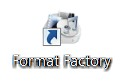
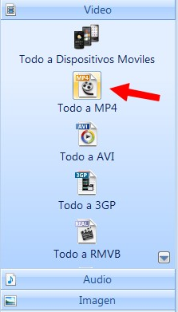
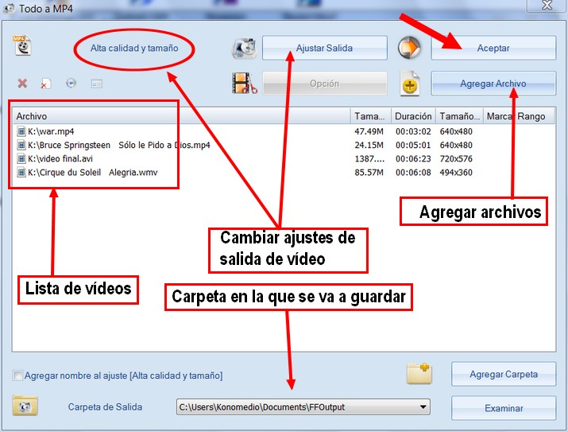
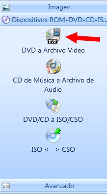
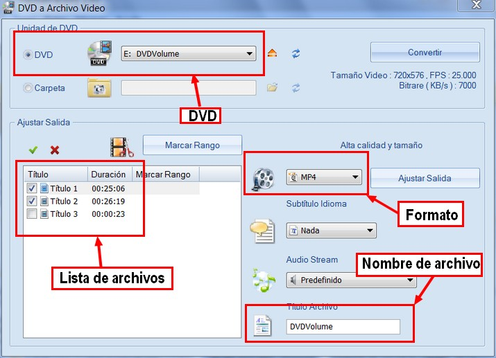

# U3. CONVERSORES DE FORMATO

## Importante

Uno de los problemas que nos podemos encontrar en el "tratamiento de vídeo" es el que tengamos un archivo lo tengamos que **convertir a otro formato determinado**. Existen numerosos programas que hacen esto. Nosotros nos decantamos por **Format Factory**, por ser gratuito, fácil de utilizar, no pone publicidad y permite realizar conversiones de varios medios diferentes (video, sonido, imagen).

**CONOCIMIENTOS PREVIOS**

*   Para aprender de forma eficiente este apartado, el alumno deberá habar aprendido los contenidos de las unidades anteriores, sobre todo en lo referente a búsqueda de vídeos, descarga de vídeos y formatos.
*   Saber instalar y desinstalar programas.
*   Dominio de manejo de archivos y carpetas.

**1\. Format Factory**

Con **Format Factory** tendrás la posibilidad de **modificar el formato de cualquier ****archivo de vídeo, audio o imagen**. Es realmente interesante porque trabaja con un gran número de formatos, entre los cuales seguramente está aquel que necesitas.

*   **Video a**: MP4/3GP/MPG/AVI/WMV/FLV/SWF.
*   **Audio a**: MP3/WMA/AMR/OGG/AAC/WAV.
*   **Imagen a**: JPG/BMP/PNG/TIF/ICO/GIF/TGA.
*   Ripea DVD a archivo de video, Ripea CD de Música a archivo de audio.
*   Los archivos MP4 soporta a: iPod/iPhone/PSP/BlackBerry, fuente RMVB

**1\. Instalación del programa**

1.  Descarga el programa en [http://www.pcfreetime.com/formatfactory/index.php?language=es](http://www.pcfreetime.com/formatfactory/index.php?language=es)
2.  Hacer clic en "[Descargar sitio 2](http://www.pcfreetime.com/public/FFSetup4.0.0.0.exe)".
3.  Una vez descargado el archivo de instalación, hacer doble clic en el archivo.
    1.  **¡Atención! Personaliza la instalación!**

    2.  ****

    3.  ****

    4.  ****

4.  Seguir las **instruccione**s de pantalla hasta instalarlo completamente.

 Presentación realizada por Julián Trullenque. Licencia by-nc

**2\. Convertir un archivo de vídeo**

1º Abre el programa Format Factory

Ejecutar programa Format Factory

2º En la pestaña lateral **"vídeo"** elige el **formato que quieras de salida**. Por ejemplo: "Todo a MP4".

Imagen 16: Captura de pantalla propia

3º Aparecerá un **cuadro de diálogo** como éste. Podremos elegir la calidad de salida (dejarlo como está). Seleccionamos los vídeos que queremos convertir. Hacemos clic en **"Aceptar"**.

Imagen 17: Captura de pantalla propia

4º En la pantalla que nos sale... hacemos clic en **Iniciar** o bien en "**Clic to Start**" y comenzará el proceso de conversión.

**3\. Convertir archivos de otros formatos**

Para convertir archivos de otros formatos (sonido e imagen) se siguen los mismos pasos. Solo hay que cambiar en la pestaña lateral izquierda la opción que deseemos.

**4\. Extraer un vídeo de un DVD**

En este apartado se propone un procedimiento para convertir el vídeo de un DVD a un archivo AVI con códec DivX o XviD. A partir de este AVI es posible extraer un fragmento y convertirlo en un formato más propio de publicación web: FLV, WMV, MOV o RAM.

1º Introduce el **DVD en el lector**.

2º Abre **Format FáctorY**.

3º Selecciona la pestaña **"DVD a archivo de vídeo"** del menú RO-DVD-CD...

Imagen 18: Captura de pantalla propia

4º En el cuadro de diálogo que aparece, elegir los archivos a extraer, el formato y la carpeta de salida. Hacer clic en **Convertir**.

Imagen 19: Captura de pantalla propia

5º En la pantalla que nos aparece... hacemos clic en **Iniciar** o bien en "**Clic to Start**" y comenzará el proceso de extracción.

## Importante

**El software e instrucciones recogidas en este capítulo se proponen como método para realizar copias de seguridad de los DVDs originales propios y siempre dentro de un uso particular no comercial. En cualquier caso esta información NO se expone para ser usada como herramienta para vulnerar materiales con copyright. La utilización que se efectúe, total o parcial del archivo de vídeo resultante, estará supeditada en todo momento a los derechos de autor y propiedad intelectual legalmente establecidos.**

