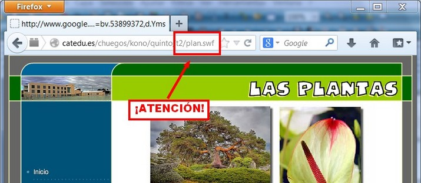
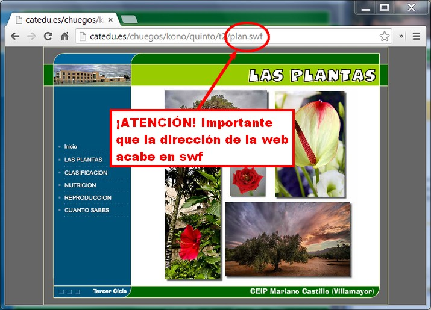
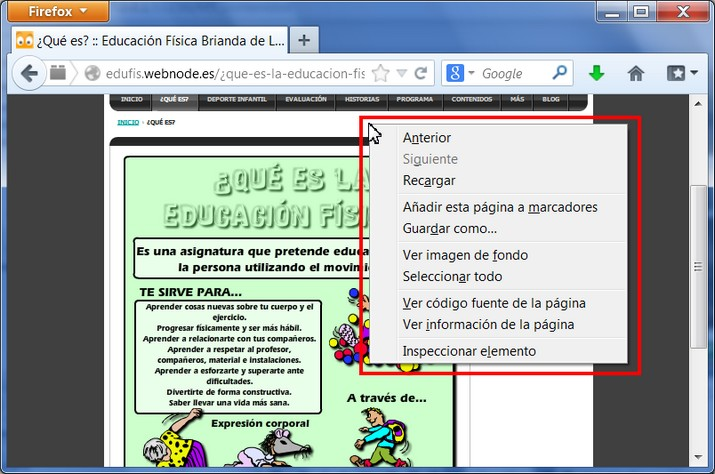
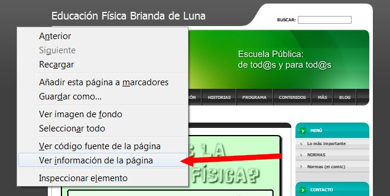
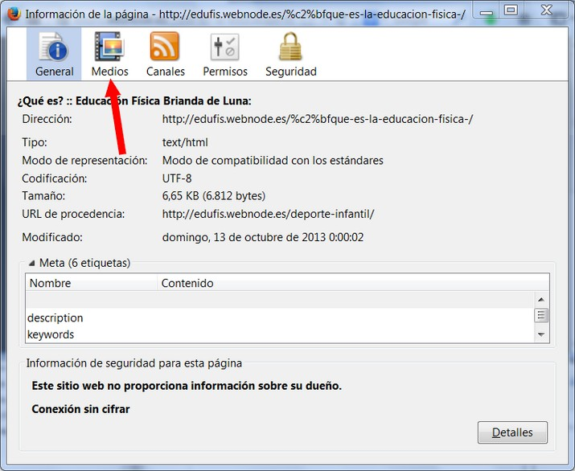

# U3. DESCARGA DE FLASH

**1\. Descarga de archivos desde el navegador**

Vamos a mostrar cómo descargar un objeto swf de una página web desde tu navegador. Parece complicado, pero se hace de una forma muy sencilla.

1º Una vez hemos encontrado el archivo en el navegador, nos aparecerá esta pantalla. Hay que darse cuenta que en la barra de **dirección la cadena finaliza con swf**, si no nos  es posible hacerlo por este método. **Válido para navegadores Google Chrome y Mozilla Firefox**.

Imagen 8: Captura de pantalla propia

2º Lo mismo en Gooogle Chrome:

Imagen 9: Captura de pantalla propia

3º Ahora solamente hay que **guardar la página en la carpeta** que queramos y así guardaremos el archivo flash. En Chrome es es **Guardar página como**...; y en Firefox es Guardar como... Observa los dos tutoriales:

Y con Google Chrome:

**2\. Utilizar programas para bajar objetos swf**

A veces nos vamos a encontrar **archivos que están incrustados en una web o blog**, y que no podemos acceder a ellos como lo habíamos hecho antes. Entonces **el comando Guardar como... no nos va a servir**. Tenemos **soluciones** variadas para cada uno de los navegadores.

**1\. Con Mozilla Firefox**

1º **Cargar** la página con la animación.

2º Hacer clic con el **botón derecho del ratón en cualquier parte de la página**. ¡Atención! no en el objeto swf. Se desplegará un menú.

 Imagen 10: Captura de pantalla propia

3º Hacer clic en **Ver información de la página**.

 

 Imagen 11: Captura de pantalla propia

4º Nos aparecerá un **cuadro de diálogo** con la información de la página. Seleccionamos el botón medios:

 

 Imagen 11: Captura de pantalla propia

6º Buscamos el archivo swf y hacemos clic en **guardar**.

  
Si usas Google Chrome y quieres descagar un flash, nada más sencillo que añadir a tu navegador la extensión [Sothink flash downloader](https://chrome.google.com/webstore/detail/sothink-flash-downloader/biceobciobbhhkplgocbaigojbnepcoi/reviews).**2\. Con Google Chrome**

Una vez instalada esta extensión, sigue los pasos para descargar la animación:

**3\. Internet Explorer**

Si usas Internet Explorer, te remitimos a la unidad 5 (VISUALIZAR OBJETOS) donde te enseñemos un programa que sirve también para descargar objetos swf. 

## Importante

*   Artículo sobre los derechos de autor: **"Publicar en un blog de forma responsable.** Tiscar Lara. año 2008: [http://tiscar.com/publicar-un-blog-de-forma-libre-y-responsable/](http://tiscar.com/publicar-un-blog-de-forma-libre-y-responsable/) Licencia [CC by-nc-sa](http://creativecommons.org/licenses/by-nc-sa/3.0/deed.es)

