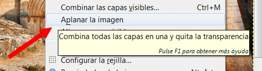

# U3. Dimensiones

Uno de los principales factores que determinan el peso de un archivo gráfico es el **tamaño de la imagen** que contiene, es decir, el número de píxeles en anchura y altura. Se recomienda utilizar un programa como de edición para definir exactamente el tamaño final con que se utilizará cada imagen.

Se puede insertar una imagen en una web o blog y luego reducir su tamaño de visualización. Sin embargo esta operación no reduce el peso final resultante del archivo gráfico. Es aconsejable reducir las dimensiones de la imagen previamente con un editor de imágenes, crear un nuevo archivo gráfico más ligero y luego integrarlo en la página.

**1\. Cambiar el tamaño de una imagen**

**1\. En GIMP**

1º Abrir el archivo. **Archivo>Abrir. **

Imagen 26: Captura de pantalla propia

2º En la ventana de imagen elige **Imagen > Escalar la imagen …**

Imagen 27: Captura de pantalla propia

3º Se muestra el cuadro de diálogo **Escalar la imagen**. Observa la animación, cómo cambia el tamaño de la imagen

  
4º En el cuadro de diálogo **Escalar la imagen. **En la casilla **Anchura** introduce el **valor 640** Observa que si el bloqueo de proporciones está activado al pulsar **enter **automáticamente se completa la **Altura proporcional **(480). Si desactivas el bloqueo, solamente cambiará el valor que modifiques.En **Tamaño de la imagen** se muestra la Anchura y Altura en píxeles de la imagen actual. Observa que puedes modificar estos valores mediante los botones de incremento/decremento o bien tecleando otros. Sin embargo si entre ambas casillas y a la derecha aparece un **icono de cadena cerrada**, cuando trates de modificar la anchura, automáticamente se definirá la altura respetando las proporciones originales y evitando que la imagen se deforme. Al hacer clic sobre este icono de bloqueo se desactivará esta proporcionalidad y podrás definir valores independientes.

Imagen 28: Captura de pantalla propia

5º Hacer clic en **Escala**.

6º Se puede deshacer la operación de escala seleccionando en la barra de menús de la ventana de imagen:**Edición > Deshacer**.

Imagen 29: Captura de pantalla propia

6º **Guarda** la imagen resultante.

**2\. Con PHOTOFILTRE**

Observa la siguiente presentación:

**3\. Con** [http://pixlr.com/editor/](http://pixlr.com/editor/)

Observa la siguiente presentación:

**2\. Cambiar el tamaño del lienzo**

En ocasiones es necesario disponer de más lienzo en blanco dentro de una imagen para añadirle más elementos. Es decir, poder aumentar un poco el documento para poder añadir algún elemento fuera de la imagen (un título, dibujo, cartel...)

**1\. ¿Cómo cambiar el tamaño del lienzo en GIMP?**

1º Una vez dentro de GIMP, elige **Archivo > Abrir**. Abrimos el archivo **ermita.jpg**.

2º En la ventana de imagen elige **Imagen > Tamaño del lienzo …**

Imagen 30: Captura de pantalla propia

3º En el cuadro de diálogo **Establecer el tamaño del lienzo de la imagen se muestra la Anchura y Altura **actuales del lienzo. En este caso 640x480 píxeles. Clic en el **icono de bloqueo de proporcionalidad** para poder aumentar la altura sin que ello implique incrementar la anchura. Tras su pulsación el icono debe tener el aspecto de dos eslabones de cadena separados.

Imagen 31: Captura de pantalla propia  

4º En la casilla **Altura** introduce el valor 580 para aumentarla y pulsa la tecla **enter**. Observa que en la vista previa de la imagen aparece un espacio en blanco por debajo de la imagen que se corresponde con el lienzo aumentado. Si pulsas el botón **Centrar** la imagen se centraría horizontal y verticalmente sobre el lienzo. Otra posibilidad es introducir manualmente en las casillas **X** e **Y** la posición en píxeles en que se situará la esquina superior izquierda de la imagen en relación con el nuevo lienzo. En el caso que nos ocupa no utilizaremos esta opción ni el botón de centrado porque GIMP crea automáticamente el espacio que necesitamos en la base de la imagen para añadir luego el texto.

Imagen 32: Captura de pantalla propia

4º Para terminar pulsa en el botón **Redimensionar**.

5º Desde la barra de menús de la ventana de imagen elige **Imagen > Aplanar imagen**. Con esta operación se fusionan las capas y la banda inferior toma el color blanco de fondo.

Imagen 33: Captura de pantalla propia

6º Ahora vamos a insertar un título a nuestra imagen: En el cuadro de herramientas de GIMP selecciona la herramienta **Texto** y a continuación haz clic sobre la banda blanca inferior.

Imagen 34: Captura de pantalla propia  

7º Se muestra una ventana para introducir el texto. Debajo de la barra de herramientas encontrarás un panel donde es posible definir la tipografía del texto: fuente, tamaño, color, estilo, etc.

8º En la pequeña ventana del **Editor de textos** de GIMP escribe, por ejemplo, "Ermita de San Miguel" y luego pulsa en el botón **Cerrar**.

9º Este es el resultado final de la imagen: (Ya podremos guardar la imagen)

Imagen 35: Captura de pantalla propia

**2\. ¿Cómo cambiar el tamaño del lienzo en PHOTOFILTRE?**

1º Una vez dentro del programa, elige **Archivo > Abrir**. Abrimos el archivo **ermita.jpg**.

2º En la ventana de imagen elige **Imagen > Tamaño del lienzo …**

**3\. con** [http://pixlr.com/editor/](http://pixlr.com/editor/)

1º Una vez dentro del programa, elige **Archivo > Abrir**. Abrimos el archivo **ermita.jpg**.

2º En la ventana de imagen elige **Imagen > Tamaño del lienzo …**

## ParaSaberMas

[Web Resizer](http://www.webresizer.com/resizer/?lang=es) es una plataforma con la que reducir en un 50%, 60% o 70%, el peso de una imagen.   
  
Esta aplicación compatible con archivos de hasta 5 MB y formato .GIF, .JPG Y .PNG, dispone de herramientas para recortar, enfocar, rotar o ajustar brillo contraste y saturación de una imagen. Web Resizer dispone también de la posibilidad de crear bordes en las imágenes cargadas.  
  
El manejo de esta aplicación web no puede resultar más sencillo e intuitivo. Acceder desde [www.webresizer.com](http://www.webresizer.com)

Imagen 36: Captura de pantalla propia

