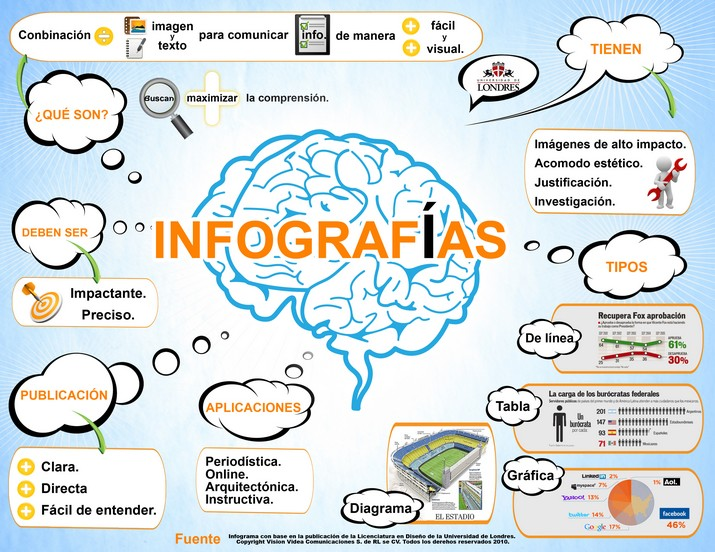

# U3. INFOGRAFÍAS

## Reflexión

**¿QUÉ ES UNA INFOGRAFÍA?** ¿Para qué sirven? ¿De qué se componen? ¿Qué tipos de infografías hay? ¿Cómo son? ¿Se pueden publicar? ¿Cómo? ...

TODAS ESTAS PREGUNTAS SE PUEDEN CONTESTAR CON UNA **INFOGRAFÍA**

var feedback54_9text = "Mostrar retroalimentación";

### Retroalimentación

