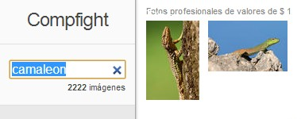

# U4. Sitios de descarga de imágenes gratuitas

Una** imagen** buena y cuidadosamente seleccionada puede aumentar ampliamente el **poder de atracción** de nuestro trabajo, puede aportar **información visual** a los contenidos y **rompe con la monotonía**. Una buena imagen brinda, **luz, vida, color** que captura la **atención del lector** y puede ayudar a **reforzar el mensaje de las palabras**.

Las imágenes de [Google](http://blogsespanol.about.com/od/red/a/Google-Comunidades-Y-Utilidades-Para-Tu-Blog.htm), son una opción muy tentadora, el problema radica en que muchas de las fotos que podemos obtener de la web en realidad no sabemos si poseen o no **derechos de autor (copyrigths)**.

A continuación te presento una serie de **portales** donde podrás encontrar muchas **colecciones de imágenes** que podrás usar en tus trabajos:

**PhotoPin**

[PhotoPin](http://photopin.com/ "Ir a PhotoPin"): Aquí encontramos fotos libre de uso que son obtenidas desde Flickr, y libres de uso comercial o personal y que sean justo lo que estabamos necesitando. **Photopin**, buscador de imágenes con [Creative Commons](http://www.educacontic.es/blog/que-son-las-licencias-creative-commons-cc "¿Qué es Creative Comons?"), nos facilita enormemente el trabajo. Utilizando principalmente el motor de búsqueda de imágenes de Flickr, nos ofrece fotos de buena calidad relacionadas con nuestros términos de búsqueda, las cuales podemos descargar en distintos tamaños y sin necesidad de registro.

Al tratarse de fotos con licencia [Creative Commons](http://www.educacontic.es/blog/que-son-las-licencias-creative-commons-cc "¿Qué es Creative Commons?"), no debemos olvidar incluir el respectivo crédito en nuestras publicaciones si queremos usarlas gratuitamente con fines personales o comerciales.

**OpenPhoto**

: Sin duda de lo mejorcito, buscador integrado, no requiere registración y cuenta con la posibilidad de bajar raw de alta calidad, listos para hacer HDRI.  

**PicDrome**

: Es una colección de imágenes de dominio público, libres de derechos de autor.Todas las fotos son de descarga gratuita para uso personal y comercial, sin restricción alguna y están disponibles en alta definición. En este sitio no necesitas registrarte para poder utilizar y descargas las imágenes, es una muy buena opción.

**Flickr**

[Flickr](http://www.flickr.com/ "Flickr"): nos encontraremos con miles de fotos con licencia Creative Commons ideales para ilustrar textos indicando siempre el enlace y el autor de la imagen.

**Banco de imágenes del INTEF**

Es una iniciativa del **Instituto Nacional de Tecnologías Educativas y de Formación del Profesorado (INTEF). **Pone en marcha un módulo de colaboración que permite a profesores, alumnos, padres y usuarios en general donar recursos audiovisuales de una manera sencilla. Este nuevo espacio de colaboración del Banco de Imágenes y Sonido pretende "hacer comunidad" en torno al mismo y conseguir que se convierta en un recurso de todos y para todos.

**School Clip Art**

[School Clip Art](http://www.school-clip-art.com/): es un motor de búsqueda para encontrar imágenes prediseñadas gratis para profesores y estudiantes. Está organizado por categorías. Las imágenes prediseñadas que puedes encontrar se proporcionan gratis para uso educativo.

**Compfight**

[Compfight](http://compfight.com/): Un buscador de imágenes **Creative Commons** entre la inmensa colección fotográfica disponible en Flickr. Solo hay que escribir la palabra clave y pulsar "intro".

Haciendo clic en la vista en miniatura de cualquier imagen se nos abre una pequeña ventana, donde se especifican los términos exactos de su licencia y podemos **descargarla en diferentes tamaños**. 

## Para saber más

*   **e-comunica: **Cómo obtener fotos para tu web: Los 10 mejores bancos de imágenes gratuitas.
*   [http://ecomunica.me/blog/como-obtener-imagenes-para-tu-web-los-10-mejores-bancos-de-imagenes-gratuitas/](http://ecomunica.me/blog/como-obtener-imagenes-para-tu-web-los-10-mejores-bancos-de-imagenes-gratuitas/). © Copyright - [ecomunica](http://ecomunica.me/) Noviembre 2013.

