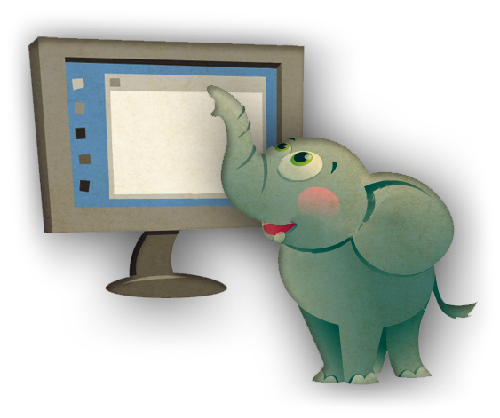
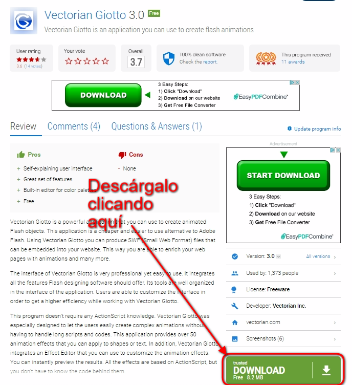

# U4. VECTORIAN GIOTTO

**CONOCIMIENTOS PREVIOS**

*   Conocimientos informáticos a nivel de usuario: saber descargar un programa de la red (internet), guardarlo en una carpeta e instalar un programa en el disco duro seleccionando diferentes opciones.
*   Haber asimilado la Unidad 1 de este módulo para distinguir el formato y la extensión swf de otros.

**1\. ¿Qué es Vectorian Giotto?**

Es una **alternativa a Adobe Flash gratuita**. Es un programa de **diseño gráfico y de animaciones**. Usando Vectorian Giotto, un software de animación flash completamente gratis, ¡tendrás la oportunidad de hacer lo que quieras y cómo lo quieras! Es gratuito para uso personal y comercial, así que ¡no hay límites a su creatividad!

 Imagen 12: autor © 2005-2010 Vectorian Inc.

**2\. Descargar e instalar el programa**

1º Descarga el programa desde [este enlace](http://vectorian-giotto.software.informer.com/3.0/).

2º Seguir las instrucciones hasta **instalar el programa**.

5º **Ejecutar** el programa.

**3\. El entorno de diseño**

Presentación realizada por Julián Trullenque. Licencia by-nc

## ParaSaberMas

**El propósito de este módulo no es aprender este programa en profundidad, ya que solo veremos una pequeñas pinceladas. Si te interesa conocer más a fondo Vectorian Giotto puedes ir a la página web del programa donde tienes un manual de uso (inglés):**

*   **Soporte Vectorian Giotto** (manual/tutorial): [http://vectorian.com/support/](http://vectorian.com/support/).

