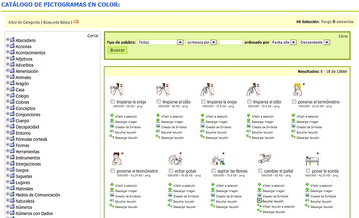
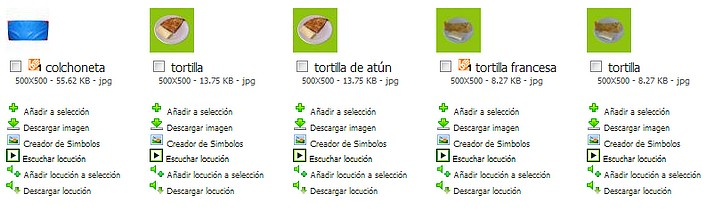
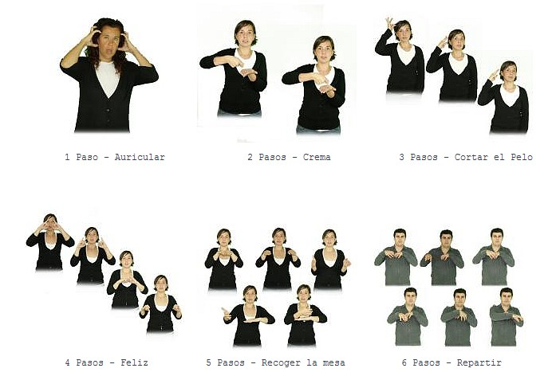
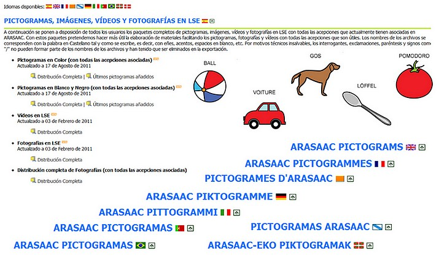
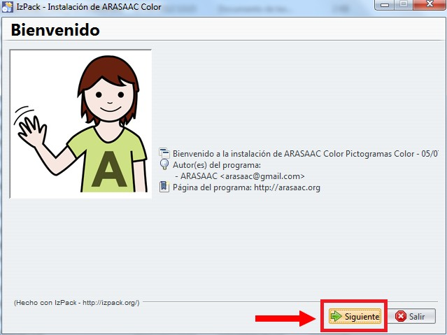
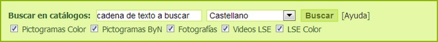
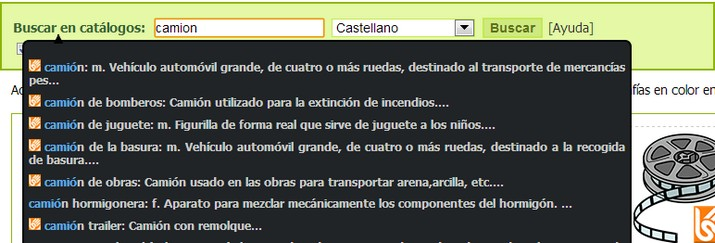
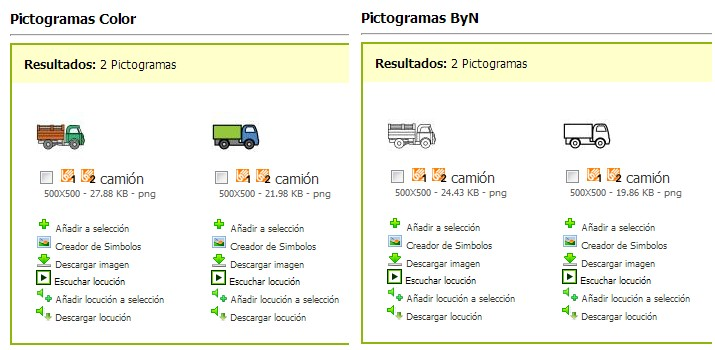
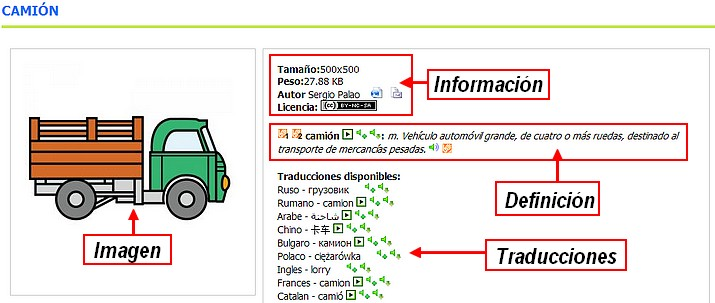
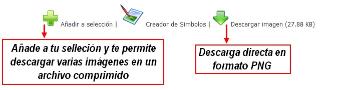

# U5. ARASAAC

[ARASAAC](http://www.catedu.es/arasaac/) (catedu.es/arasaac/) es el **Portal Aragonés de la Comunicación Aumentativa y Alternativa**, una web que incluye, además de bastante información relacionada con la Comunicación Aumentativa y Alternativa, una enorme **colección de imágenes y pictogramas** que pueden ser usados con aquéllos que tienen algún tipo de necesidad especial en la comunicación.

Entre sus secciones podemos encontrar contenido de todo tipo, desde pictogramas en color clasificados en categorías (con licencia Creative Commons), hasta vídeos o programas que pueden ayudar a los profesionales en su día a día.

Este portal es una inciativa del **Gobierno de Aragón** a través del **CATEDU**. Los autores son J**osé Manuel Marcos y David Romero** y los dibujos son de **Sergio Palao**.

**1\. Pictogramas**

**1\. Pictogramas en color**

El número actual de pictogramas únicos en color ronda los **9500 pictogramas**, cantidad que va aumentando progresivamente. Cuando los pictogramas se catalogan en ARASAAC, cada uno de ellos puede asociarse a una o más acepciones del diccionario de castellano, lo que hace que, actualmente, se disponga de más de 15600 pictogramas en color.

 

**2\. Pictogramas en blanco y negro**

Además del catálogo de pictogramas en color se ofrece otro catálogo con los pictogramas en blanco y negro para su utilización en aquellos casos en los que no se requiere o no se desea utilizar el color.

El catálogo de pictogramas en blanco y negro dispone de **menor número de pictogramas con respecto al de color**, porque muchos de ellos, sin la presencia del color, no tendrían sentido. Un ejemplo claro es el de las banderas o el de las señales de tráfico. Actualmente son más de 13500 los pictogramas en blanco y negro disponibles. 

**3\. Fotografías**

El catálogo de fotografías nos permite acceder a i**mágenes reales de objetos preparados en formato cuadrado** y con el objeto isolado en fondo, preferentemente, blanco. Son imágenes, por tanto, ya preparadas para ser utilizadas como pictogramas y que tienen una gran utilidad en estadios iniciales de introducción de los sistemas aumentativos o alternativos de comunicación al ser el nexo de unión entre el objeto real y los pictogramas que se introducen con posterioridad.

El catálogo cuenta actualmente con unas 1400 fotografías.

 

**4\. Vídeos en LSE (Lengua de Signos Español)**

Este catálogo ofrece vídeos con el signado de 4100 términos y de sus definiciones de la RAE.

En muchos centros la comunicación aumentativa a través de pictogramas se complementa con el **uso de signos de bimodal que, en la mayor parte de los casos, coincide con la Lengua de Signos Española**.  De ahí la utilidad de este catálogo para todos aquellos profesores que utilicen signos de modo complementario o, para aquellos, que están aprendiendo la Lengua de Signos. 

**5\. Fotografías en LSE (Lengua de Signos Español)**

El catálogo de Fotografías en Lengua de Signos Española supone una novedad en relación al uso de la misma en tanto ofrece imágenes fijas que, posteriormente, pueden ser insertadas en documentos impresos, cosa totalmente imposible con el uso de los vídeos. 

Para poder crear la imagen fija del signado de una palabra lo que se hizo fue descomponer el signado en los pasos clave que lo definen en fotogramas que, posteriormente, se compusieron en una única imagen. De este modo, podemos encontrar fotografías con hasta 6 pasos agrupados en una única imagen. 

**6\. Locuciones**

Además de las traducciones en 15 idiomas, ARASAAC dispone de **locuciones** en **11 idiomas**. Estas locuciones permiten elaborar diferentes **materiales multimedia** para la comunicación aumentativa y para la **inmmersión lingüística** de usuarios de otros países. 

Las locuciones pueden ser escuchadas en el propio portal, añadidas a "Mi selección" o descargadas a nuestro ordenador para ser utilizadas en otros programas (como por ejemplo, Power Point). Si estamos navegando por el portal en Castellano las locuciones que oiremos o descargaremos serán en castellano. En cambio si cambiamos el idioma del portal a Inglés o Francés, las locuciones serán en ese idioma.

**2\. Descargas**

Con el fin de facilitar la elaboración de materiales y de poder disponer en local de los recursos que ofrece el portal sin tener que estar conectado a Interrnet, ARASAAC ofrece una serie de paquetes desde la [**Zona de Descarga**](http://arasaac.org/descargas.php) que nos permitirán bajar e instalar los pictogramas, vídeos y fotografías en LSE, fotografías y locuciones.

## Importante

Los paquetes de pictogramas nunca están actualizados al 100% ya que aunque el catálogo de pictogramas se sigue actualizando de modo continuo, los paquetes de pictogramas se realizan una o dos veces al año. Así pues, para estar al día de los últimos pictogramas añadidos, recomendamos visitar periódicamente el catálogo de Pictogramas en Color y Blanco y Negro y navegar por las últimas páginas de pictogramas añadidos.

**3\. Instalar paquetes**

Para poder instalar los paquetes de pictogramas se requiere tener instalado previamente [**Java**](http://www.java.com/es/download/) en nuestro ordenador. Al estar hechos en Java estos paquetes son multiplataforma y permiten instalar los pictogramas en cualquier sistema operativo que soporte Java (Windows, Linux o MacOS).

Una vez descargado el paquete de pictogramas, por ejemplo el de Color se nos pedirá, si estamos utilizando Windows 7 u 8, autorización para ejecutar Java. Pulsaremos en **SI**. Seguimos las instrucciones en pantalla.

**4\. Sistemas de búsqueda**

Una de las grandes potencialidades del portal ARASAAC pasa por su amplio catálogo de recursos gráficos y por estar, todos ellos, catalogados según un diccionario de acepciones y categorías que permiten su búsqueda de modo muy flexible y, al mismo tiempo, muy preciso.

1º En la página de [**inicio**](http://arasaac.org/index.php) y [**catálogos**](http://arasaac.org/catalogos.php) del **portal ARASAAC** disponemos de un buscador que nos permite realizar búsquedas en los diferentes catálogos de recursos gráficos. Podemos seleccionar el idioma, si solo queremos imágenes, fotografías...

 

2º La peculiaridad de este buscador es que, conforme se va escribiendo la palabra a buscar, el sistema va sugiriendo palabras que comiencen por la cadena de texto que vayamos escribiendo y que dispongan de recursos en algunos de los catálogos que tengamos marcados en los cuadros de selección debajo del cuadro de búsqueda.

3º De entre los resultados que se nos ofrecen haremos clic sobre aquel que nos interesa obtener recursos gráficos. En este caso se selecciona "**camión**".

4º De esta forma para la palabra **"camión"** en los resultados de la búsqueda podremos ver el logotipo de LSE. Si hacemos clic en él se abrirá una nueva ventana que nos permitirá visionar el signado de la acepción.

5º Ya podemos descargar la imagen que buscábamos.

## Importante

Todos los buscadores por palabras de ARASAAC son sensibles a la ortografía. Eso implica que la búsqueda debe ser realizada utilizando acentos, diéresis, etc. En caso de no seguir esta recomendación podemos no obtener resultados de todos los términos deseados.

