# U5. FLAX

**CONOCIMIENTOS PREVIOS**

*   Conocimientos informáticos a nivel de usuario: saber descargar un programa de la red (internet), guardarlo en una carpeta e instalar un programa en el disco duro seleccionando diferentes opciones.
*   Haber asimilado la Unidad 1 de este módulo para distinguir el formato y la extensión swf de otros.

**1\. ¿Qué es FLAX?**

**FlaX** es una utilidad gratuita, compatible con el sistema operativo Windows, con la que cualquiera puede crear fácilmente bonitos **textos animados** con diferentes efectos en flash. Las posibilidades son prácticamente ilimitadas pues podemos combinar más de 256 efectos para conseguir los textos animados más originales.

Además podemos conseguir textos mucho más atractivos usando diferentes fuentes, añadiéndole audios en formato mp3 o imágenes como fondo. La aplicación hasta hace un tiempo shareware ha pasado a ser gratuita, presentándose con una interfaz intuitiva dividida en varias ventanas flotantes.

Una de sus ventajas es que **nos muestra un vista previa de la animación de texto que estamos creando**, por lo que podemos observar en todo momento cuál es el resultado de nuestro diseño. Una vez creado el texto animado podemos usarlo como salvapantallas o insertarlo en nuestra página o blog.

**2\. Instalar Flax**

1.  **Descarga** el programa en [flax510-setup.exe](http://catedu.es/materialesaularagon2013/imagen/flax510-setup.exe)
2.  Hacer **doble clic en el archivo** descargado (flax510-setup.exe).
3.  Seguir las instrucciones de instalación.

**3\. Las ventanas de Flax**

 Presentación realizada por Julián Trullenque. Licencia by-nc

**4\. Crear una animación de texto**

1º Ejecuta el programa.

2º En la ventana "**Text properties" escribe el texto**: puede ser un título, una poesía, un párrafo.... que nos sea muy extenso. Selecciona las propiedades del texto: tipo de letra, tamaño, posición...

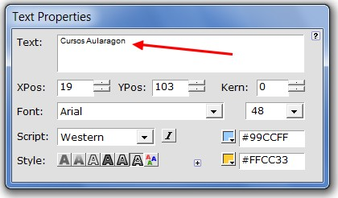

Imagen 33: Captura de pantalla propia

3º Eliges los **efectos de texto**. Puedes ir probando el que más te gusta y hacer combinaciones, variando los parámetros. En este caso hemos elegido **"Surfing y Surf USA"**

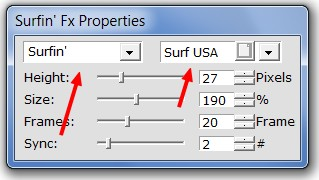

Imagen 34: Captura de pantalla propia

4º Eliges las **propiedades de la película. **En este caso hemos elegido de tamaño 700x150 pc, color blanco y 20 fps.

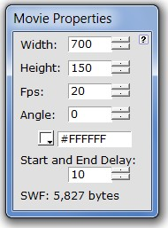

Imagen 35: Captura de pantalla propia

5º Mira en la **ventana escenario** y verás como queda la película final. Es muy fácil.

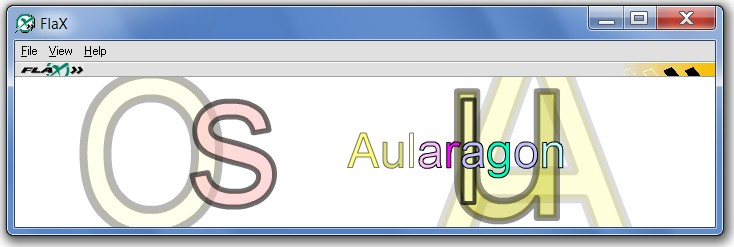

Imagen 36: Captura de pantalla propia

**1\. Más opciones**

_1\. Para insertar una imagen de fondo_

1º Clic en **View>Background Pic Properties**.

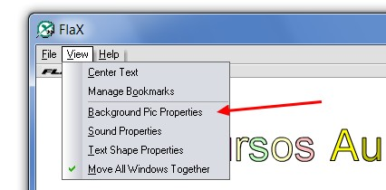

Imagen 37: Captura de pantalla propia

2º Aparecerá un **cuadro de diálogo**, en el que elegimos la **imagen de fondo**, que la podemos ajustar a la ventana o escalarla.

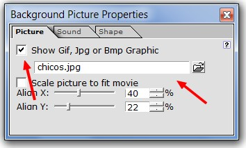

Imagen 38: Captura de pantalla propia

_2\. Para poner un clip de música_

1º Hacer clic en **View>Sound Properties.**

2º Aparecerá un **cuadro de diálogo** en el que buscaremos un sonido en formato MP3 (menos de 100 kb):

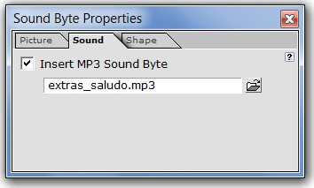

Imagen 39: Captura de pantalla propia

_3\. Cambiar propiedades del texto_

1º Aparte del tamaño, tipo de letra, posición y colores, también podemos **variar la forma del título**. Clic en **View>Text Shape Properties.**

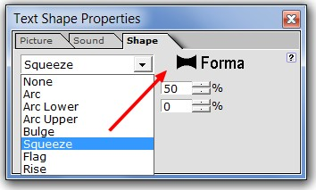

Imagen 40: Captura de pantalla propia

Al final de esta forma quedaría nuestra animación: (sin sonido, para no molestar).

 

Animación realizada por Julián Trullenque. Licencia by-nc

**5\. Las opciones de archivo**

Se puede guardar, abrir archivos guardados, probar archivos antes de procesarlos; exportarlos como flash (SWF), ejecutables (EXE), insertados en una web (SWF+HTML):

1º **Abre** el archivo [final.flx](http://aularagon.catedu.es/materialesaularagon2013/imagen/final.flx)

2º Vamos a crear un **archivo flash (swf)**. Clic en File>**Export as SWF**...

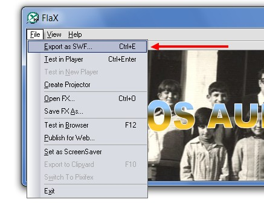

Imagen 41: Captura de pantalla propia

2º Aparecerá este **cuadro de diálogo**. Podemos elegir dónde exportar el archivo y otras opciones.

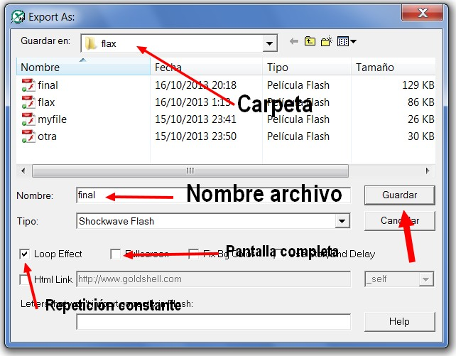

Imagen 41: Captura de pantalla propia

El archivo que hemos creado será en formato SWF, no podremos verlo si no tenemos un programa para visualizarlo (en el próximo apartado). Pero **FLAX guarda** este archivo en **otros formatos**. Son estos:

*   [**final.flx**](http://aularagon.catedu.es/materialesaularagon2013/imagen/final.flx), que contiene el documento editable utilizando la herramienta Flax. Al hacer doble clic sobre su icono, se iniciará Flax que arranca en modo edición con este documento. 
*   **[final.swf](http://aularagon.catedu.es/materialesaularagon2013/imagen/final.1.swf)**, que contiene la película en formato compacto. Al hacer doble clic sobre él se iniciará su visionado en la ventana del reproductor independiente de Flash. Este archivo no es editable. 
*   [**final.htm**](http://aularagon.catedu.es/materialesaularagon2013/imagen/final.htm). Es una página HTML que contiene la información necesaria para mostrar la película SWF dentro de la ventana del navegador.  Al hacer doble clic sobre este archivo se iniciará el navegador por defecto y mostrará una página con la película. El archivo HTML no contiene la película sino una referencia de vinculación al archivo SWF. Por esta razón es necesario que, al menos por defecto, ambos archivos se encuentren en la misma carpeta. Obviamente es necesario subir estos dos archivos al servidor web para que el usuario pueda visualizar la animación Flash al cargar el documento HTML.

Otras funciones del menu File (archivo):

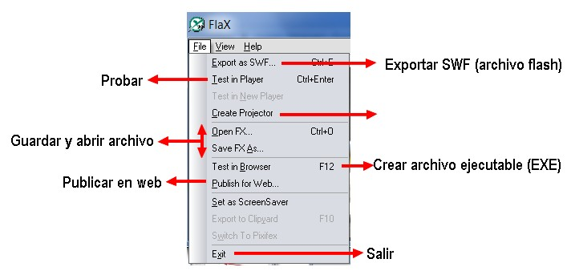

Imagen 41: Captura de pantalla propia

