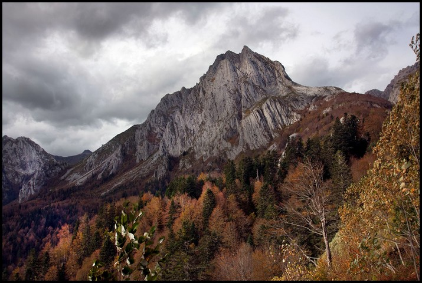

# U5. Optimizar una imagen

## Importante

En casi todos los recursos digitales utilizaremos **imágenes para decorar o complementar nuestros textos** de una forma gráfica y atractiva. Las imágenes son un **recurso necesario e imprescindible** para conseguir mantener la atención de nuestros alumnos y evitar aburrirlos.

Sin embargo, **no siempre las utilizamos correctamente**, bien por desconocimiento, por descuido (y falta de tiempo) o por no tener la base de conocimiento necesaria para utilizarlas correctamente. En esta unidad veremos una guía para **optimizar imágenes en nuestros trabajos de una forma efectiva**, con un buen equilibrio entre calidad de imagen y tamaño de imagen.

Imagen 37: autor Julián Trullenque. Licencia CC by-nc

Cuando descargamos **nuestras fotos** de la cámara **nunca suelen estar a nuestro gusto**. Casi siempre es necesario hacer unos retoques para **mejorar la imagen**. O aunque esté bien realizada, podemos hacer esos retoques para mejorarla. En esta unidad aprenderemos a modificar los siguientes parámetros:

*   ILUMINACIÓN.
*   COLOR.
*   ENFOQUE.

**CONOCIMIENTOS PREVIOS**

*   Antes de abordar este capítulo, el alumno ha de conocer los aspectos referenciados en los temas precedentes: conocer los aspectos básicos de la imagen y haberse familiarizado con el uso del editor de imagen.
*   El alumno debe conocer el uso de las herramientas básicas (copiar, pegar, eliminar, recortar ...) para poder aplicar los efectos o para, aplicando los mismos, mejorar la calidad de la imagen final generada.

