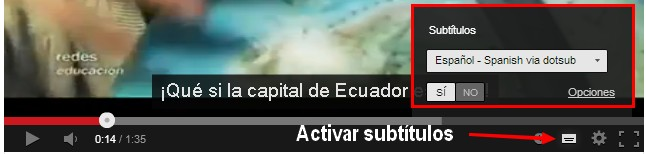
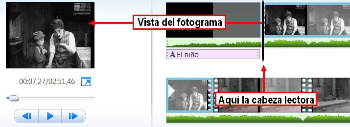
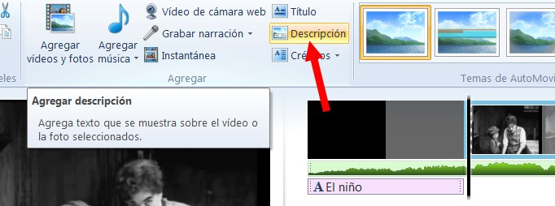
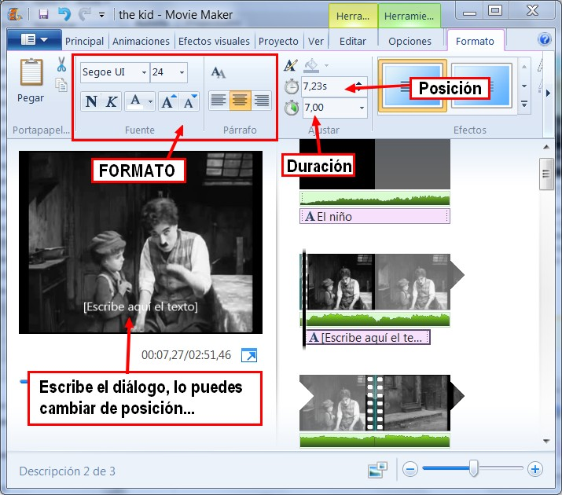
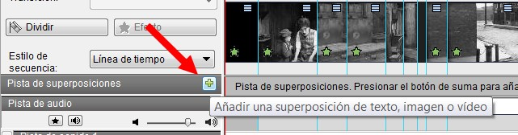
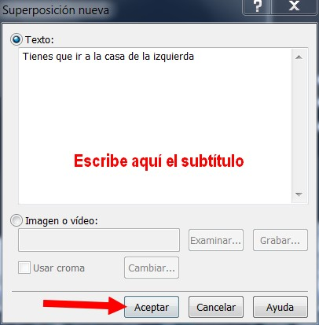
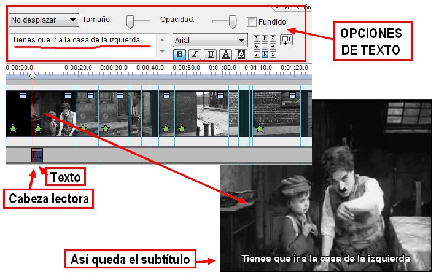

# U6. SUBTITULADO DE VÍDEOS

## Conocimiento previo

https://youtu.be/l_oyn8wboWI

Si observas en este vídeo hay un botón rectangular en la parte inferior derecha en el que si hacer clic, activarás los subtítulos del vídeo. Pero otras veces no encontrarás subtítulos, y en las producciones que hagas tú mismo, tendrás que añadirlos si quieres.

Los **vídeos online son cada vez más populares** en todo el mundo y empiezan a rivalizar con la televisión. Los subtítulos de los vídeos son una mina de oro sin explotar. Hacen que los videoclips sean accesibles a los que tienen **problemas de audición**; nos permiten **comprender el contenido de un vídeo en lenguas que no hablamos**; .... Tendrás que plantearte utilizar los subtítulos si quieres mejorar tus videoclips, si quieres expresar tus ideas y tus opiniones poniendo un comentario sobre el contenido de un vídeo que veas colgado, si quieres entrar y participar en las formas más innovadoras de compartir vídeos online.

### 1\. Subtitular una película con Movie Maker

Agregar subtítulos con Movie Maker a una película de vídeo es muy fácil. Solo tienes que cargar la película, elegir el lugar donde vas a poner el subtítulo y agregarlo. Luego puedes cambiar el formato, color y tamaño del texto.

1º Carga la película **thekid.wlmp**.

2º **Amplía la vista** de la línea de tiempo para tener más precisión.

3º Coloca la cabeza reproductora en el lugar que quieras insertar es subtítulo.

4º Clic en el icono Descripción.

5º Ya puedes **escribir el texto del subtítulo**, darle formato, color, posición...

6º Continúa agregando el **resto de los subtítulos**. En este caso te recomendamos que utilices un color de letra para cada subtítulo:

*   *   *   Blanco: narrador.
        *   Amarillo: protagonista 1 (Chaplin).
        *   Azul claro: protagonista 2 (niño).
        *   Rosa claro: actores secundarios.
        *   Verde: onomatopeyas.

### 2\. Subtitular una película con VideoPad

En la Unidad 4 aprendimos a crear títulos con el comando "subtítulos". En esta ocasión vamos a trabajar con la opción **"Pista de Superposiciones"**. Es una opción más cómoda y fiable.

1º Abre el archivo **thekid.vpj, **que habías utilizado en la otra unidad.

2º Clic en el signo **más ("+")** de la pestaña **Pista de Superposiciones**.

3º Se abrirá este cuadro de diálogo.

4º **Escribimos** el subtítulo y hacemos clic en **Aceptar**.

5º Podemos cambiar opciones de formato de texto, tamaño, desplazamiento...

6º Continúa agregando el **resto de los subtítulos**. En este caso te recomendamos que utilices un color de letra para cada subtítulo:

*   Blanco: narrador.
*   Amarillo: protagonista 1 (Chaplin).
*   Azul claro: protagonista 2 (niño).
*   Rosa claro: actores secundarios.
*   Verde: onomatopeyas.

## Para saber más

Para el subtitulado de películas hay muchos recursos. Solo hemos querido presentar el trabajo con los dos programas que estamos viendo en este curso, pero hay muchos más. Tanto soluciones on-line como herramientas instalables. No obstante, si quieres aprender más, te dejamos estos dos artículos donde verás otras posibilidades.

*   **EMEZETABLOG: "Manual para subtitular vídeos"**. Presenta el uso de un buen programa exclusivo para subtitular vídeos. [http://www.emezeta.com/articulos/manual-para-subtitular-videos](http://www.emezeta.com/articulos/manual-para-subtitular-videos), por **José Román Hernández Martín (Manz)**. Licencia CC by-nc-sa 3.0. Noviembre 2011.  
    
*   **Herramientas para subtitular: buenísimas para los vídeos**. Presenta una serie de heramientas on-line para subtitular vídeos. [http://www.etwinning.net/](http://www.etwinning.net/es/pub/collaborate/modules/subtitling_tools_great_for_et.htm). **Artículo escrito por Daniela Arghir, Embajadora de eTwinning en Rumania. **Forma parte del programa Comenius, del EU para la Enseñanza Escolar.

### 3\. Jugar en la web 2.0 con subtítulos de vídeo

Estas páginas son un buen ejemplo de las posibilidades educativas de webs diseñadas como ejercicios de pura diversión. Las primeras tienen unas posibilidades limitadas a una colección de vídeos determinada, mientras que las segundas, **DotSUB y Owerstream**, permiten utilizar cualquier vídeo de la web.

**1\. Hitler Creator – Crear video parodia de la película de Hitler**

Seguramente ya viste más de una parodia de la película de Hitler “la caída“.. muchos usuarios en internet se dedicaron a crear vídeos con escenas de la película y le tornaron un lado divertido.

[Hitler creator](http://chevismo.com/hitler) es una aplicación online que te va a permitir crear tu propio video de Hitler con los subtitulos que quieras en cuestión de minutos. Lo único que nos puede detener es nuestra creatividad.

https://youtu.be/WdVdVJfof9M

**2\. Jugando a subtitular películas en Bombay TV y Classiktv**

[Bombay TV](http://www.grapheine.com/bombaytv/index.php?lang=es) es una aplicación en línea que nos permite añadir a pequeños trozos de película subtítulos, textos que son convertidos a voz o nuestra propia voz a través del micrófono. La herramienta está disponible en diversos idiomas entre los que se encuentra el español y no es preciso registrarse. Podemos escoger entre más de 70 escenas breves (30 segundos) sacadas de películas de Bollywood.

[Classik TV](http://www.grapheine.com/classiktv/) es una aplicación parecida a la anterior, te permite crear divertidos vídeos, eligiendo y editando escenas de películas antiguas en blanco y negro a las que se pueden añadir subtítulos.

**3\. Subtitular on-line con Overstream**

El editor [Overstream Editor](http://www.overstream.net/), disponible gratis en la red,  te permite crear y sincronizar tus subtítulos en cualquier videoclip online en YouTube, Google Video, vimeo..., almacenarlos en el servidor Overstream.

_¿Cómo funciona?_

*   Lo más fácil es registrase en la página y añadir un marcador especial a tu barra de herramientas Firefox. Mientras se ve el vídeo en cualquier página de Internet,  al hacer clic en el marcador, aparece una interfaz simple pero efectiva que proyecta palabras leíbles en cualquier momento del videoclip.
*   En los otros navegadores, sólo tienes que hacer clic en "Create Overstream".

### 4\. Subtitular on-line con DotSUB

[DotSUB](http://dotsub.com/) es una **herramienta muy útil para el trabajo docente** ya que permite subtitular vídeos, tanto vídeos nuestros como alojados en internet. Además de crear nuestros recursos para clase también podemos utilizar la herramienta para proponer actividades a los alumnos. **Los vídeos se comparten fácilmente en la red** y se pueden incrustar en nuestros blogs gracias al código de embebido.

_¿Cómo funciona?_

1.  Accedemos a la [web DotSUB](http://dotsub.com/), nos registramos.
2.  Creada nuestra cuenta, ya podemos comenzar a subtitular los vídeos.
    1.  Seleccionamos la opción "**Upload your video and begin subtitling**".
    2.  Completamos los **datos de nuestro vídeo.** Video Tittle  (Título), Short description (descripción corta), License (licencia), Language (idioma), Country (País), Genre (Género), Productor (Productor), Director (Director) y Make this video public (vídeo público).
    3.  Después de completar estos datos podemos **subir un vídeo nuestro o poner la dirección de un vídeo alojado en internet**. Admite vídeos hasta 25 minutos.
    4.  **Esperamos a que suba el vídeo**, la aplicación nos avisará cuando haya completado este proceso por medio de un correo electrónico.
    5.  Hacemos clic en **"transcribe video"** y comenzamos a editar los subtítulos.

