# U6. Trabajar con textos

Hay muchas cosas que se pueden hacer para variar la apariencia de un texto, además de variarlo con diferentes fuentes y/o colores. Como convertir un texto en una selección o una ruta, rellenarlo, trazar su contorno, transformarlo o aplicarle herramientas de GIMP para conseguir efectos interesantes. 

**CONOCIMIENTOS PREVIOS**

*   Antes de abordar este capítulo, el alumno ha de conocer los aspectos referenciados en los temas precedentes: conocer los aspectos básicos de la imagen y haberse familiarizado con el uso del editor de imagen.
*   El alumno debe conocer el uso de las herramientas básicas (copiar, pegar, eliminar, recortar ...).
*   El alumno debe conocer los aspectos antes mencionado de la optimización y mejora de imagen.

**1\. Los textos**

**Los textos son algo básico en el tratamiento de imágenes por ordenador** y GIMP nos proporciona herramientas útiles para su uso. Los podemos generar con:

*   La herramienta texto de la caja de herramientas de **GIMP**.
*   Con los filtros>Logotipos de **GIMP**.
*   La herramienta texto de **Photofiltre**.
*   Con **pixlr.com** es posible crear textos pero no admite muchas variables.

Vamos a ver cómo **crear un texto artístico con Gimp y Photofiltre.**

**2\. Crear un texto con GIMP**

1º Desde la ventana principal de GIMP selecciona **Archivo > Nuevo**.

 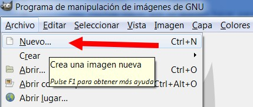

Imagen 71: Captura de pantalla propia

2º En el cuadro de diálogo **Crear una imagen nueva** introduce las dimensiones, por ejemplo, **640** y **80** en las casillas **Anchura** y **Altura **respectivamente.

 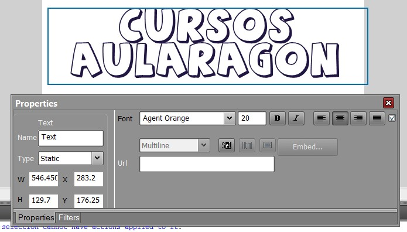

Imagen 72: Captura de pantalla propia

3º Haz clic sobre la herramienta **Texto** en el cuadro de herramientas. 

 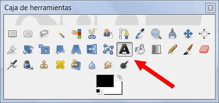

Imagen 73: Captura de pantalla propia

4º En el panel de **Opciones de herramienta** elige como tipo de fuente **Arial Black** y como tamaño **80 puntos**. Clic sobre la casilla **Color** de las opciones de herramienta. Elegir el color deseado. Hacer clic en **Aceptar**.

 

 Presentación realizada por Julián Trullenque. Licencia CC by-nc

5º Aparecerá un pequeño **editor de texto**. Escribe "AULARAGÓN" por ejemplo. Para terminar pulsa el botón **Cerrar**.

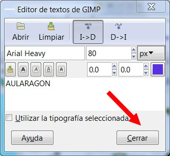

Imagen 74: Captura de pantalla propia

6º En el cuadro de herramientas de GIMP elige la herramienta **Mover capas y selecciones**.

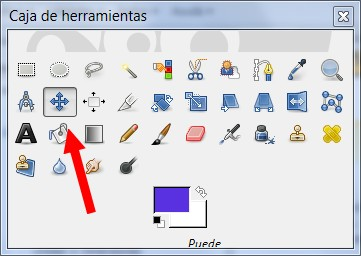

Imagen 75: Captura de pantalla propia

7º Con esa herramienta coloca el título en el centro del documento.

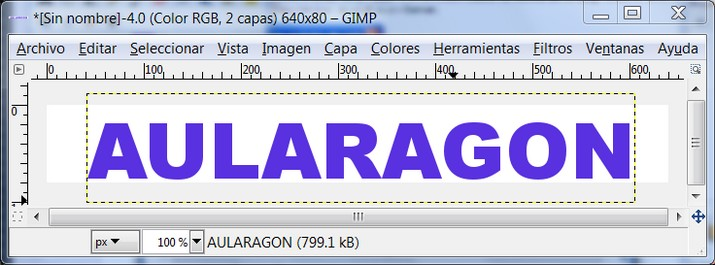

Imagen 76: Captura de pantalla propia

8º Para aplicar un efecto especial al texto selecciona por ejemplo: **Filtros>Alfa a logotipo>Contorno 3D**.

9º En el cuadro de diálogo de **Opciones** admite los parámetros por defecto y pulsa en el botón **Aceptar**.

10º Al cabo de unos instantes se ha creado un atractivo rótulo.

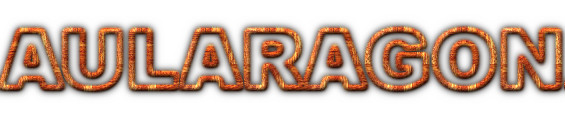

Imagen 77: autor Julián Trullenque. Licencia CC by-nc

11º Para deshacer la aplicación de este efecto, en la ventana de la imagen elige **Editar>Deshacer**.

12º Repite los pasos 8º-11º para probar otros efectos especiales sobre el texto. A continuación se proponen algunos.

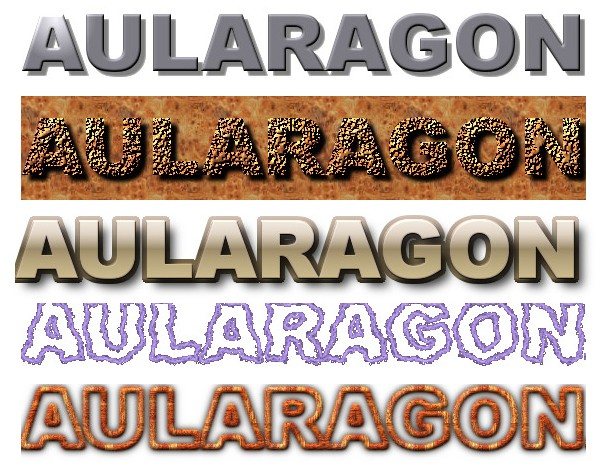

Imagen 78: autor Julián Trullenque. Licencia CC by-nc

**2\. Crear un texto con PHOTOFILTRE**

1º Desde la ventana principal de Photofiltre selecciona **Archivo > Nuevo**.

 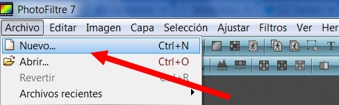

Imagen 79: Captura de pantalla propia

2º En el cuadro de diálogo **Nuevo** introduce las dimensiones, por ejemplo, **640** y **80** en las casillas **Anchura** y **Altura **respectivamente.

 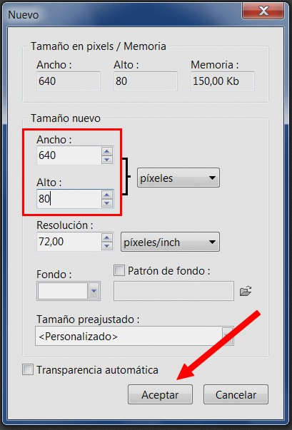

Imagen 80: Captura de pantalla propia

3º Haz clic sobre la herramienta **Texto** en el cuadro de herramientas. 

 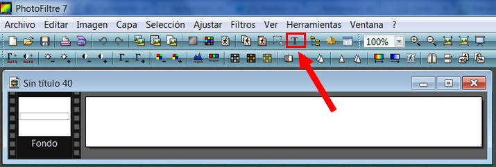

Imagen 81: Captura de pantalla propia

4º En el cuadro de diálogo **Texto** elige como tipo de fuente **Arial Black** y como tamaño **40 puntos**. Clic sobre la casilla **Color** de las opciones de herramienta. Elegir el color deseado. Hacer clic en **Aceptar**.

 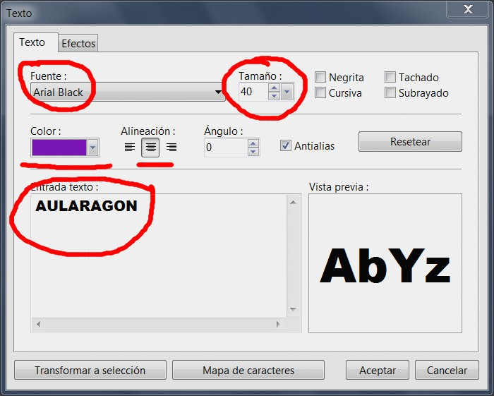

Imagen 82: Captura de pantalla propia

5º El **texto resultante** será cómo el que aparece en la siguiente imagen.

Imagen 83: autor Julián Trullenque. Licencia by-nc

6º Ahora en esta presentación te mostraremos como hacer un **título más adornado**.

7º Otro ejemplo de títulos que se pueden hacer.

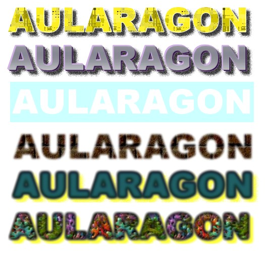

Imagen 84: autor Julián Trullenque. Licencia CC by-nc  

## ParaSaberMas

**En internet va a encontrar bastantes páginas (web 2.0) que te ayudarán a generar títulos creativos. Aquí te presentamos alguno:**

****[Xara 3D Online](http://www.starchat1.cl/xara/Xara.htm): ****Hasta 30 caracteres. Lo puedes encontrar en diversas páginas insertado como un gadget en formato online y libre. 

[**Cool Text**](http://cooltext.com/): 41 estilos, 20 diseños de botones Sombra o sin sombre. Y guardarlo en multitud de formatos, con o sin transparencia. Puedes guardarlo mediante el botón derecho del ratón o descargando la imagen. Excelente herramienta.

[**GraffitiCreator**](http://www.graffiticreator.net/): Crea tus graffitis a partir de numerosas posibilidades de cambiar colores, estilos, tamaño, rotación, etc. El único inconveniente es que al ser una aplicación flash no permite guardar la imagen creada con el botón derecho del ratón y hay que realizar una captura de pantalla.

[**Myspace Text Generator**](http://www.glitter-graphics.com/myspace/text_generator.php): Otra opción más de generar texto animado y con una funcionalidad para blogs, webs, etc. Además permite descargar el código para ser insertado en un blog o una web y si se desea como imagen hay que proceder a realizar una captura de pantalla.

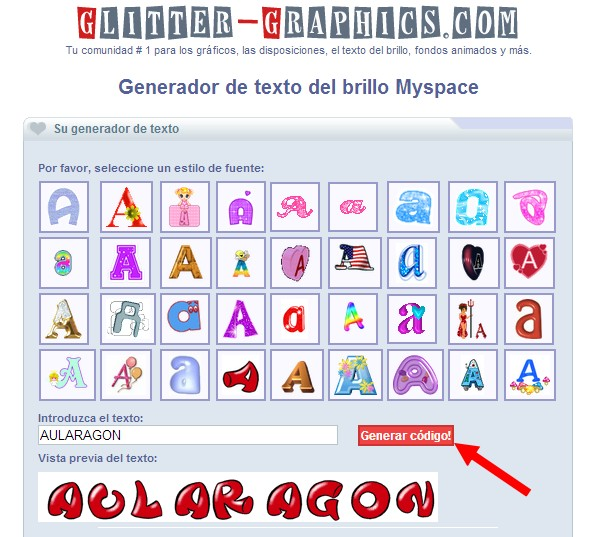

Imagen  85: Captura de pantalla propia 

