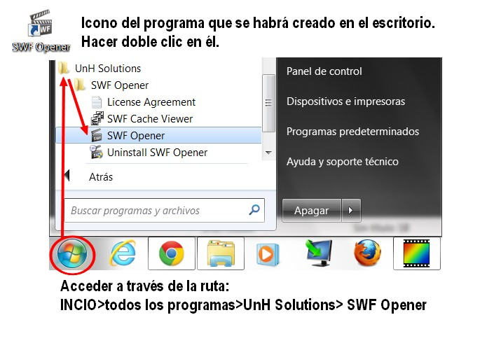
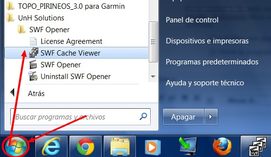

# U6. VISUALIZAR OBJETOS SWF

## Importante

Ya tenemos la idea de lo que son los archivos SWF y hasta sabemos crearlos. Ahora bien, **si no tenemos en nuestro ordenador un programa para visualizarlos tendremos que abrirlos con un navegador** que irá más lento y seguramente nos abrirá alguna ventana preguntándonos si queremos ejecutar el archivo. Para visualizar directamente los objetos flash (SWF) tenemos unos cuantos reproductores.

Desde aquí te vamos a presentar y recomendar **"SWFOPENER"** por las siguientes razones:

*   Gratuito.
*   Ocupa poco espacio.
*   Sencillo de instalar y usar.
*   Sirve para visualizar y descargar archivos swf.
*   Tiene una versión portable.

**1\. Instalar el programa**

1.  Descarga el programa haciendo clic en [SWFOpenerSetup.exe](http://aularagon.catedu.es/materialesaularagon2013/imagen/SWFOpenerSetup.exe)
2.  Doble clic en **"SWFOpenerSetup"** para instalarlo
3.  Seguir las **instrucciones en pantalla**.

**2\. SwfOpener para ver objetos flash**

1º Instalar el programa (visto punto anterior).

2º Ejecutar el programa.

Imagen 42: Captura de pantalla propia

3º **Se abrirá esta ventana**. Pasa el ratón por los elementos para saber qué son.

 Presentación realizada por Julián Trullenque. Licencia CC by-nc

4º **Descarga** el archivo [ruleta.swf](http://aularagon.catedu.es/materialesaularagon2013/imagen/ruleta.swf)

5º **Abre el programa SwfOpener** y carga la animación que acabas de descargar. También lo puedes hacer haciendo doble clic sobre el archivo ruleta.swf (si tienes configurado para que SwfOpener abra archivos swf). Prueba todas las posibilidades.

6º Prueba a abrir **otros archivos swf** con este programa.

**3\. Descargar archivos flash (swf) con swfOpener**

En la unidad 2 de este módulo aprendimos a buscar archivos SWF y a descargarlos en los navegadores Chrome y Mozilla. SwfOpener lleva un programa adjunto **SWF Cache Viewer** que nos va a servir para descargar este tipo de archivos.

1º Localiza una página web con un archivo flash. Por ejemplo: [http://catedu.es/chuegos/](http://catedu.es/chuegos/) Internet Explorer guardará en la "Caché" todos los archivos cargados para que vaya más rápido.

2º Inicia el programa **SWF Cache Viewer**. Desde el **Menu inicio>Todos los Programas>UnH Solutions>SWF Cache Viewer.**

Imagen 43: Captura de pantalla propia

3º También podemos acceder a través de **SWF Opener** a través d ela ruta: **View>View SWF Caché...** De cualquiera de las dos maneras se abrirá este programa.

 Presentación realizada por Julián Trullenque. Licencia CC by-nc

4º **Selecciona el archivo** que quieres descargar.

5º Selecciona, busca la carpeta donde lo quieres guardar. **Select Folder**

6º **Clic** en:

*   **SAVE**: si solo quieres salvar los archivos seleccionados.
*   **SAVE AS**: Salvar esl archivo seleccionado donde quieres y cambiando el nombre.
*   **SAVE ALL**: Salvas todos los archivos.

