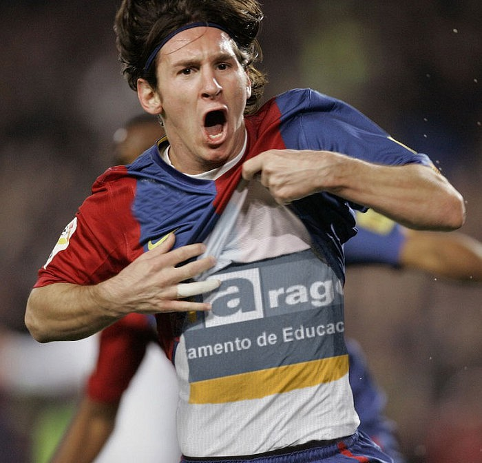

# U7. Fotomontajes

## Reflexión

Este efecto de la foto fue creada en [Funny.Pho.to](http://funny.pho.to/). Por Julián Trullenque

var feedback102_9text = "Mostrar retroalimentación";

### Retroalimentación

¿Has visto este fin se semana el Partido en la Tele? Messi marcó un gol y llevaba una camiseta con el logotipo de AULARAGON. 

Esto, evidentemente **es un montaje**... ¿Te gustaría hacer uno igual? Pues en esta unidad vas aprender algunos conceptos sobre **composición, recorte y montaje**... y también te presentaremos algunas aplicaciones on-line para hacer **divertidos fotomontajes**.

**CONOCIMIENTOS PREVIOS**

*   Antes de abordar este capítulo, el alumno ha de conocer los aspectos referenciados en los temas precedentes: conocer los aspectos básicos de la imagen y haberse familiarizado con el uso del editor de imagen.
*   El alumno debe conocer el uso de las herramientas básicas (copiar, pegar, eliminar, recortar ...) para poder aplicar los efectos o para, aplicando los mismos, mejorar la calidad de la imagen final generada.
*   El alumno debe dominar el control de la imagen.

