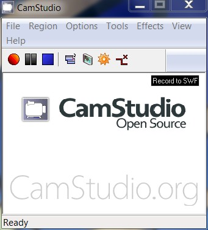

# U7. GRABACIÓN DE UNA EXPLICACIÓN

<iframe src="https://player.vimeo.com/video/78410403" width="640" height="537" frameborder="0" allowfullscreen></iframe>

Vídeo realizado por Julián Trullenque. Subido en [Vimeo.com](http://vimeo.com/78410403). Licencia CC by-nc

## Importante

Cuando se trata de explicar cómo funciona un tipo de aplicación web, describir los pasos para crear un determinado efecto de Gimp, configurar una opción en Windows, etc, En estos casos quizás las palabras no sean suficiente. Pero con la ayuda de los screencasts (capturas de pantalla), se puede describir mejor.

**Un screencast es un vídeo en el que quedan registrados la pantalla del ordenador**, y opcionalmente audio, con los movimientos del ratón y las acciones realizadas por el usuario que lo produce. Por lo tanto los screencasts son herramientas excelentes de aprendizaje.

Es  rápido y se puede incrustar en cualquier sitio web como cualquier vídeo. En los screencasts, la película sustituye a las explicaciones escritas que siempre son más aburridas.

Estas herramientas son muy utilizadas en tutoriales que explican cómo manejar programas de ordenador, o cosas similares. También las podemos utilizar para crear explicaciones para nuestra clase.

### 1\. Crear videotutoriales con WINK

[Wink](http://www.debugmode.com/wink/) es una herramienta que sirve para capturar en un archivo de vídeo lo que está pasando en tu monitor. Especialmente útil para preparar presentaciones o demostraciones, Wink puede realizar videos del Escritorio al completo, de ventanas concretas, o de un área de espacio que podemos determinar nosotros mismos.

<object type="application/x-shockwave-flash" data="http://aularagon.catedu.es/materialesaularagon2013/imagen/tut1.swf" width="715" height="536"><param name="src" value="http://aularagon.catedu.es/materialesaularagon2013/imagen/tut1.swf"></object>

Presentación realizada por Julián Trullenque. Licencia CC by-nc

Los archivos que creemos pueden ser utilizados en animaciones Flash, o también podemos mantener el formato original y reproducirlos con el propio Wink en una ventana del explorador.

<object type="application/x-shockwave-flash" data="http://aularagon.catedu.es/materialesaularagon2013/imagen/tut2.swf" width="715" height="536"><param name="src" value="http://aularagon.catedu.es/materialesaularagon2013/imagen/tut2.swf"></object>

Presentación realizada por Julián Trullenque. Licencia CC by-nc

Incluye además una serie de prácticas herramientas de edición con las que podrás añadir leyendas de texto, botones y bocadillos a la animación creada, y así quedar completamente satisfecho con el resultado obtenido.

*   Descargar el [programa Wink](http://www.debugmode.com/wink/download.htm).

### 2\. Crear videotutoriales con CamStudio

[**CamStudio**](http://camstudio.org/) es una herramienta que permite capturar la actividad de la pantalla de tu PC y generar un archivo de vídeo (.avi) o un archivo Flash (.swf). Resulta muy útil para crear manuales sobre el uso de programas informáticos y, en general, para el desarrollo de contenidos.

*   [Descargar CamStudio](http://www.um.es/gat/servicios/CamStudio.zip).
*   **TUTORIAL de CamStudio:**[http://www.um.es/atica/gat/gat2/recursos/camstudio/](http://www.um.es/atica/gat/gat2/recursos/camstudio/). Universidad de Murcia, octubre 2005.

 

### 3\. Crear tutoriales on-line

Hasta aquí te hemos mostrado dos programas gratuitos instalables sen tu ordenador para crear grabaciones de pantalla. En este apartado te vamos a mostrar algunas alternativas on-line:

**1\. APOWERSOFT CREA VIDEOTUTORIALES**

[APOWERSOFT](http://www.apowersoft.com/free-online-screen-recorder) es una aplicación online que sin registro nos va a a permitir crear videocapturas de pantalla con audio e imágenes. Los vídeos se guardan automáticamente en una carpeta en nuestro pc para hacer uso de ellos como queramos.

https://youtu.be/lgV4BjHMm8k

**2\. SREENCAST CREAR VIDEOTUTORIALES**

[Screencast-O-Matic](http://www.screencast-o-matic.com/) es una herramienta que a diferencia de otras no requiere instalar ninguna aplicación en el ordenador ya que se trata de una aplicación web. Está basada en Java, por lo que se puede utilizar en equipos con sistema operativo Linux, Windows o iOS.

Esta aplicación la vamos a utilizar principalmente para crear nuestros propios tutoriales online pero tambíen es útil para hacer demostraciones de aplicaciones web o grabar vídeos de nuestros juegos entre otras muchas cosas.

**3\. SCREENR**

Os presento un servicio 2.0, que puede ser interesante para llevar a clase, se llama "[Screenr](http://www.screenr.com/)". Éste nos permite grabar unos vídeo tutoriales de hasta 5 minutos, el registro es gratuito pero a tráves de una cuenta en Google, Yahoo, FB o Twitter. Este servicio 2.0 se podría utilizar para que los propios alumnos graben un vídeo tutorial sobre la utilización de sus servicios 2.0 para enseñarlo a sus compañeros o para que los maestros veamos si utilizan bien una herramienta, etc.

## Para saber más

Hemos presentado varias alternativas tanto on-lino como programas instalables. Hemos intentado que los formatos de salida sean diferentes: ejecutables, flash, vídeo... Pero hay muchas más y como en todo tipo de recursos van apareciendo más. Si quieres conocer más alternativas, te dejamos este artículo.

*   **EMEZETASBLOG: 18 programas gratis para capturar pantalla en vídeo**. [http://www.emezeta.com/articulos/18-programas-gratis-para-capturar-pantalla-en-video](http://www.emezeta.com/articulos/18-programas-gratis-para-capturar-pantalla-en-video), por **José Román Hernández Martín (Manz)**. Licencia CC by-nc-sa 3.0. Octubre 2012.

